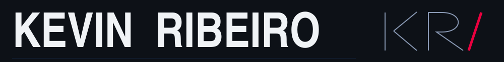
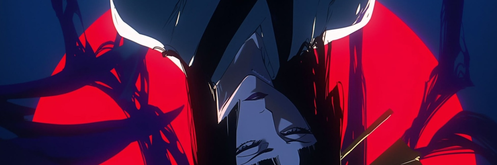

# 

**Backend Software Engineer · C# / .NET**  
Cloud · Distributed Systems · São Paulo, BR

   
  <picture>
    <source media="(max-width: 600px)" srcset="./assets/threads-mobile.svg" />
    
  </picture>

I develop **.NET backends** for financial systems, e-commerce and payment integrations. My work spans APIs, asynchronous processing, legacy modernization and production support — including performance, resilience and observability.

**ASP.NET Core · SQL Server · AWS · Azure · Messaging · Docker**

## Selected work

### ResumeMatcher

ORIGINAL PROJECT · IN DEVELOPMENT

A SaaS in development for analyzing how well a resume matches a job description using an LLM.

**Engineering focus:** backend APIs, cloud and document processing.  
**Product principle:** improve a resume's presentation without inventing experience or skills.

C# / .NET · LLM integration · Document processing · Cloud

---

### [SalesWebMvc](https://github.com/KevinRibeiroo/SalesWebMvc)

LEARNING PROJECT · C# / ASP.NET CORE MVC

Sales management with sellers, departments and date-filtered records. The service layer uses Entity Framework Core and asynchronous queries, with handling for deletion constraints and update conflicts.

Entity Framework Core · LINQ · Relational data · MVC

### [Alethe Agents](https://github.com/KevinRibeiroo/alethe-agents)

FORK · STUDY & EXPERIMENTATION

My study fork of [Kc1t/alethe-agents](https://github.com/Kc1t/alethe-agents), a desktop workspace for coding agents and terminals. I'm exploring agent orchestration, persistent sessions and developer workflows. **The original project was created by Kc1t.**

Upstream stack: Tauri · Rust · React · TypeScript

## Engineering toolkit

| Area | Core tools & practices |
| :--- | :--- |
| **Backend** | C# · .NET / ASP.NET Core · REST APIs · Microservices |
| **Data** | SQL Server · Entity Framework · Dapper · Redis |
| **Integration** | Kafka · Amazon SQS · Asynchronous processing |
| **Cloud & delivery** | AWS · Azure · Docker · CI/CD |
| **Reliability** | Grafana · Datadog · Observability · Performance · Production support |

Additional technologies I've worked with

PostgreSQL · MySQL · Oracle · Terraform · Kubernetes · Java · React · Angular · TypeScript

---

[LinkedIn](https://www.linkedin.com/in/kevinribeiroandrade) · [Email](mailto:kevinribeirodeandrade@gmail.com)
